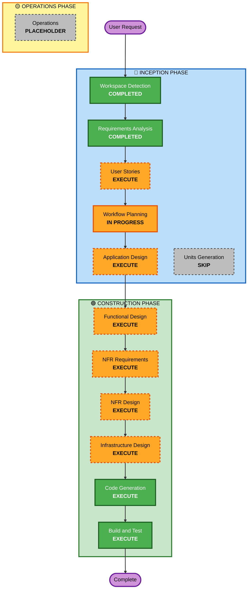

# Execution Plan

## Detailed Analysis Summary

### Transformation Scope
- **Transformation Type**: Greenfield - New application from scratch
- **Primary Changes**: Complete authentication system with 4 API endpoints
- **Related Components**: 
  - API layer (Express routes and controllers)
  - Business logic layer (services)
  - Data access layer (DynamoDB models)
  - Email service integration (Nodemailer)
  - Authentication middleware (JWT)
  - Validation middleware (rate limiting, input validation)

### Change Impact Assessment
- **User-facing changes**: Yes - Complete API for user registration, login, and password reset
- **Structural changes**: Yes - New MVC application structure with TypeScript
- **Data model changes**: Yes - New DynamoDB tables for users and password reset tokens
- **API changes**: Yes - Four new REST API endpoints
- **NFR impact**: Yes - Security (JWT, bcrypt), performance (rate limiting), scalability (AWS/DynamoDB)

### Risk Assessment
- **Risk Level**: Medium
- **Rollback Complexity**: Easy (greenfield project, no existing users)
- **Testing Complexity**: Moderate (unit + integration + e2e tests required)

## Workflow Visualization



### Text Alternative
```
Phase 1: INCEPTION
- Stage 1: Workspace Detection (COMPLETED)
- Stage 2: Requirements Analysis (COMPLETED)
- Stage 3: User Stories (EXECUTE)
- Stage 4: Workflow Planning (IN PROGRESS)
- Stage 5: Application Design (EXECUTE)
- Stage 6: Units Generation (SKIP)

Phase 2: CONSTRUCTION
- Stage 7: Functional Design (EXECUTE)
- Stage 8: NFR Requirements (EXECUTE)
- Stage 9: NFR Design (EXECUTE)
- Stage 10: Infrastructure Design (EXECUTE)
- Stage 11: Code Generation (EXECUTE)
- Stage 12: Build and Test (EXECUTE)

Phase 3: OPERATIONS
- Stage 13: Operations (PLACEHOLDER)
```

## Phases to Execute

### 🔵 INCEPTION PHASE
- [x] Workspace Detection (COMPLETED)
- [x] Requirements Analysis (COMPLETED)
- [ ] User Stories - EXECUTE
  - **Rationale**: Multiple user personas (new users, existing users, users who forgot password), clear user workflows, acceptance criteria needed for testing
- [ ] Workflow Planning (IN PROGRESS)
- [ ] Application Design - EXECUTE
  - **Rationale**: Need to define components (controllers, services, models), methods, business rules, and service layer for MVC architecture
- [ ] Units Generation - SKIP
  - **Rationale**: Single monolithic application, no need to decompose into multiple units of work

### 🟢 CONSTRUCTION PHASE
- [ ] Functional Design - EXECUTE
  - **Rationale**: Need detailed business logic for authentication, password hashing, token generation, email validation
- [ ] NFR Requirements - EXECUTE
  - **Rationale**: Security requirements (JWT, bcrypt, rate limiting), performance needs, AWS deployment considerations
- [ ] NFR Design - EXECUTE
  - **Rationale**: Need to incorporate security patterns, rate limiting design, JWT implementation, email service integration
- [ ] Infrastructure Design - EXECUTE
  - **Rationale**: Need to map to AWS services (DynamoDB, potential Lambda/ECS deployment, email service configuration)
- [ ] Code Generation - EXECUTE (ALWAYS)
  - **Rationale**: Implementation of all components, controllers, services, models, middleware
- [ ] Build and Test - EXECUTE (ALWAYS)
  - **Rationale**: Comprehensive testing strategy (unit + integration + e2e), build verification

### 🟡 OPERATIONS PHASE
- [ ] Operations - PLACEHOLDER
  - **Rationale**: Future deployment and monitoring workflows

## Estimated Timeline
- **Total Phases**: 3 (INCEPTION, CONSTRUCTION, OPERATIONS)
- **Total Stages to Execute**: 10 stages
- **Estimated Duration**: 2-3 hours for complete workflow execution

## Success Criteria
- **Primary Goal**: Fully functional Node.js authentication API with TypeScript and MVC pattern
- **Key Deliverables**: 
  - 4 REST API endpoints (register, login, forgot-password, reset-password)
  - DynamoDB integration with user and token models
  - JWT authentication implementation
  - Email service integration with Nodemailer
  - Rate limiting middleware
  - Comprehensive test suite
  - API documentation (Swagger + Postman)
  - Deployment-ready code for AWS
- **Quality Gates**: 
  - All tests passing (unit + integration + e2e)
  - Code follows MVC pattern
  - TypeScript compilation successful
  - API documentation complete
  - Security requirements met (password hashing, JWT, rate limiting)
